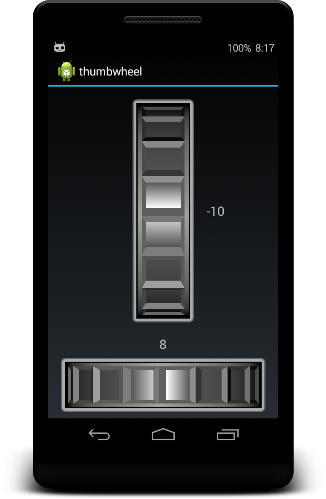

# ThumbWheel Widget

Custom Android Widget using OpenGL ES

## Some Notes

* This is free and open software developed for **research and educational** purposes only
* HORIZONTAL and VERTICAL orientation
* CLAMP and REPEAT mode
* XML attribute support
* Tested width Android 4.4.4 (API Level 19)

## Screenshot

